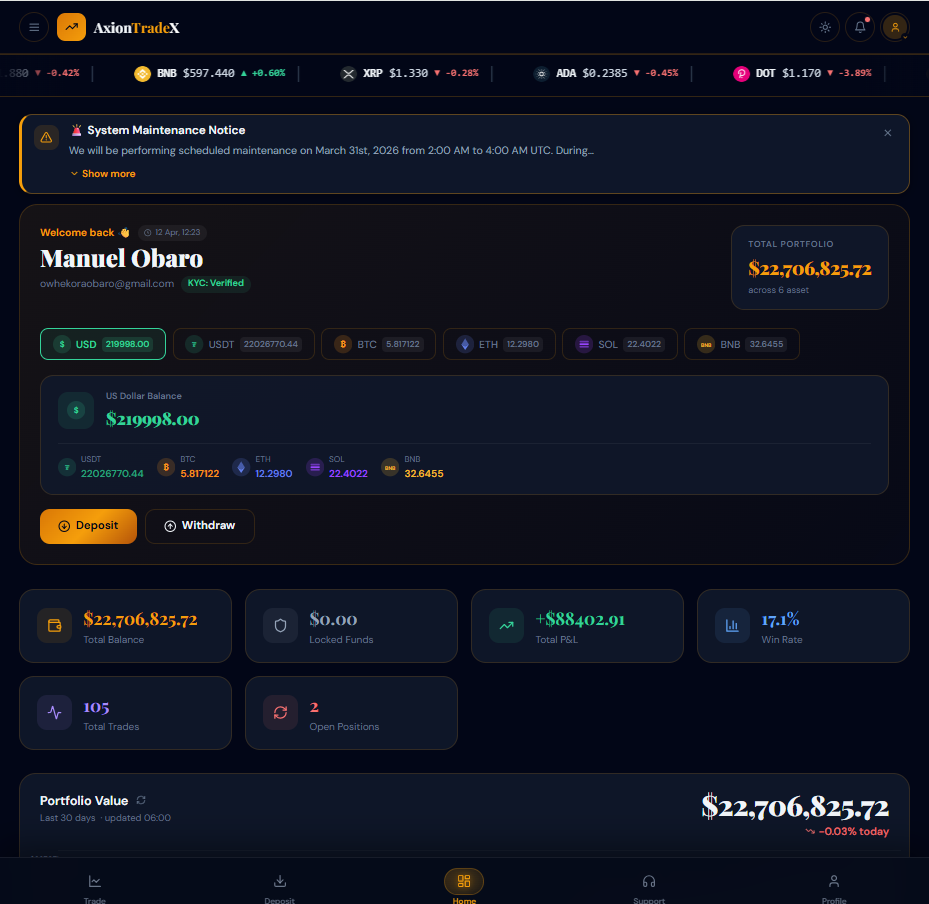
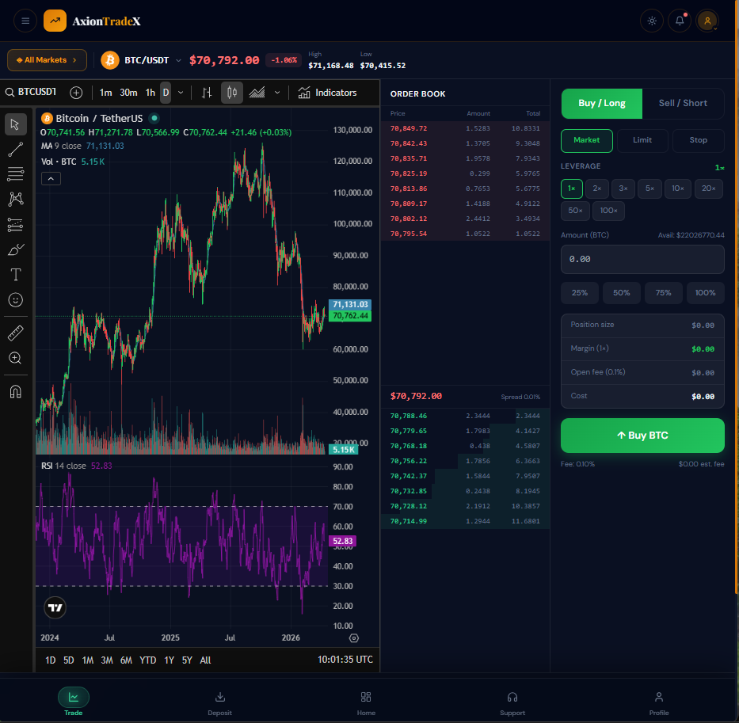
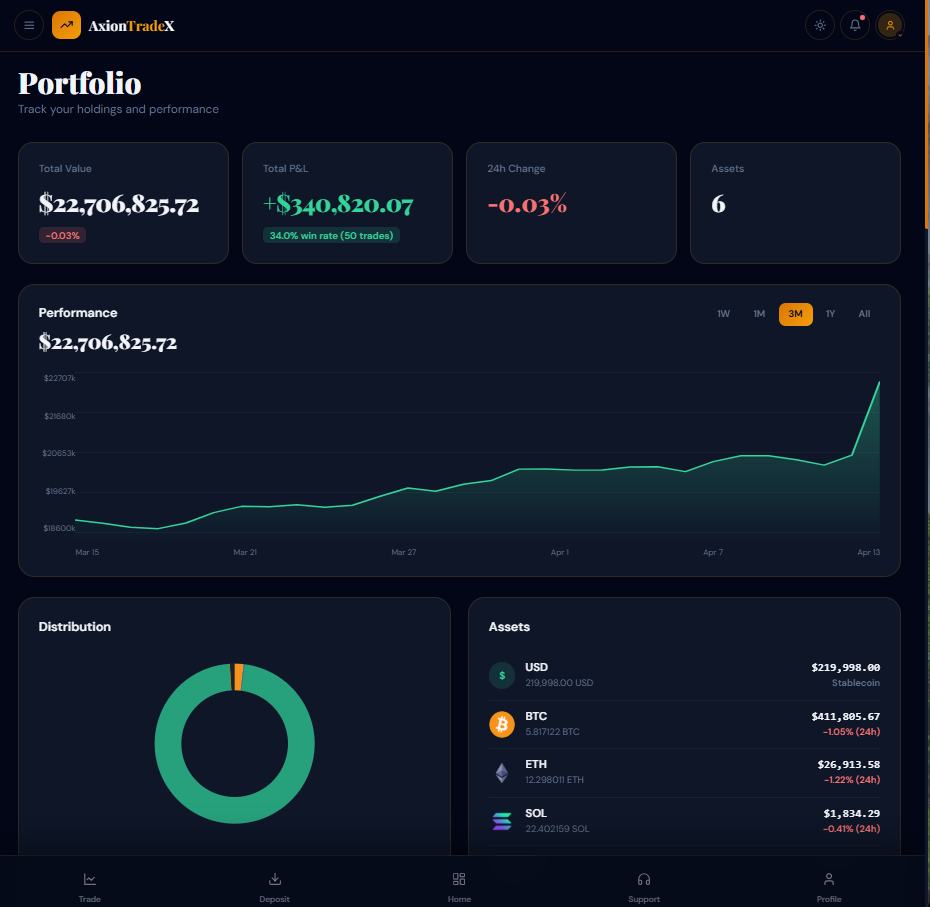
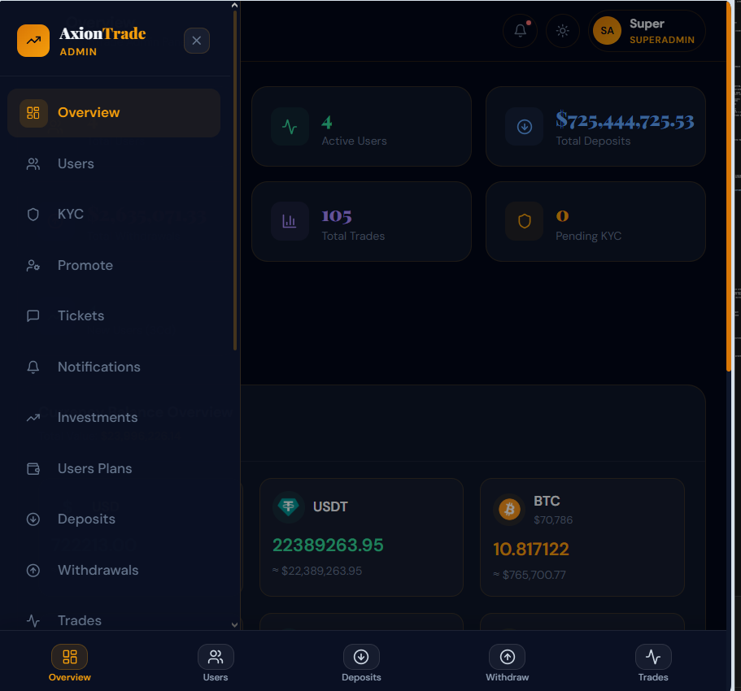

# 🚀 AxionTradeX — Full-Stack Crypto Trading Platform

AxionTradeX is a full-stack crypto trading platform that simulates real-world trading environments, allowing users to manage portfolios, execute trades (demo & live), and securely store digital assets.

This project was built to deeply understand **trading systems, financial flows, and secure web application architecture**.


## 🌐 Live Demo

> Frontend: https://your-frontend-url
> Backend API: https://your-backend-url


## ✨ Key Features

### 🔐 Authentication & Security

* JWT-based authentication
* Password hashing & secure sessions
* Two-Factor Authentication (2FA) using Google Authenticator
* Secure HTTP headers using Helmet
* OTP verification for sensitive actions (e.g., withdrawals)


### 💼 Wallet & Portfolio System

* Multi-currency crypto wallet system
* Real-time balance tracking
* Portfolio overview with asset distribution
* Locked funds handling during active trades


### 📈 Trading Engine

* **Demo Trading** (practice without real funds)
* **Live Trading Simulation**
* Leverage trading support
* Buy/Sell order execution logic
* Profit & loss (PnL) calculation
* Trade lifecycle management (open → active → closed)


### 💸 Transactions

* Deposit & withdrawal system
* OTP-secured withdrawals
* Transaction history tracking
* Admin approval/rejection flow


### 🧠 Learning & Insights

* Built with real trading concepts:

  * Margin & leverage mechanics
  * Liquidity & locked balances
  * Risk exposure handling
* Designed to mimic real exchange workflows

## 🖥️ Frontend (Client)

A modern, responsive UI built as a trading dashboard + marketing landing page.

### ⚙️ Tech Stack

* React (with Hooks)
* Vite
* Tailwind CSS
* Context API (state management)

## 📸 Screenshots

### 🧭 Trading Dashboard

### 📊 Market & Charts

### 💼 Portfolio Overview

### 🏠 Landing Page

### 🛠️ Admin Dashboard


## ✨ Core Features
### 📊 Real-Time Trading System
- Live market data powered by WebSockets (no polling, real-time updates)
- Integrated TradingView charts for professional-grade technical analysis
- Order book with bid/ask spread and liquidity depth simulation
- Real-time trade execution engine (buy/sell with instant state updates)
### 💼 Portfolio & Wallet System
- Multi-currency crypto wallet (USDT + other assets)
- Dynamic portfolio tracking with balance updates
- Locked funds handling during open trades
- Profit & Loss (PnL) calculations in real-time
### ⚙️ Trading Engine
- Demo trading environment for practice
- Live trading simulation with leverage support
- Margin calculation and risk exposure handling
- Full trade lifecycle management (open → active → closed)
### 🤖 Automation
- Automated trading bot capable of executing trades based on logic/strategy
### 💳 Financial Infrastructure
- Payment gateway integration for deposits
- Withdrawal system with OTP verification
- Transaction history and tracking system
### 🔐 Security & Compliance
- JWT authentication & protected routes
- Google Authenticator 2FA implementation
- Secure HTTP headers via Helmet
- KYC verification system


## ⚙️ Backend (Server)

A robust backend handling authentication, trading logic, and financial flows.

### 🧱 Tech Stack

* Node.js + Express
* MongoDB (database)
* JWT (authentication)
* Helmet

### 🔧 Core Responsibilities

* User authentication & authorization
* Wallet balance management
* Trade execution engine
* Transaction processing
* OTP & 2FA verification


## 📁 Project Structure

axiontrade/
├── backend/        # Express API, DB models, trading logic
├── frontend/       # React app (UI + trading dashboard)


## 🚀 Getting Started

### 1. Clone the repo

```bash
git clone https://github.com/your-username/axiontrade.git
cd axiontrade

### 2. Setup Backend

```bash
cd backend
npm install
```

Create `.env`:

```env
PORT=5000
MONGO_URI=your_mongo_uri
JWT_SECRET=your_secret
```

Run backend:

```bash
npm run dev
```

---

### 3. Setup Frontend

```bash
cd frontend
npm install

Create `.env`:

```env
VITE_API_URL=http://localhost:5000/api
```

Run frontend:

```bash
npm run dev
```

---

## 🔐 Environment Variables

### Backend

* `MONGO_URI`
* `JWT_SECRET`
* `PORT`

### Frontend

* `VITE_API_URL`

---

## 📌 Future Improvements
- High-frequency trading (HFT) simulation engine with latency optimization
- Cross-exchange arbitrage system with price aggregation APIs
- Institutional-grade risk engine (VaR, exposure limits, stress testing)
- Full production deployment with scalability (microservices + load balancing)


---

## 🧠 What I Learned

* Designing real-world trading systems
* Handling financial logic (PnL, leverage, margin)
* Secure authentication & authorization flows
* Managing complex state across frontend & backend
* Building scalable full-stack applications

---

## 👤 Author

**Obaro**
Full-Stack Developer (JavaScript / MERN)

---

## ⭐ Why This Project Matters

This project goes beyond a simple UI — it demonstrates:

* Real-world financial system thinking
* Backend architecture design
* Security best practices
* End-to-end product development

---

## 📄 License

This project is for educational and portfolio purposes.
